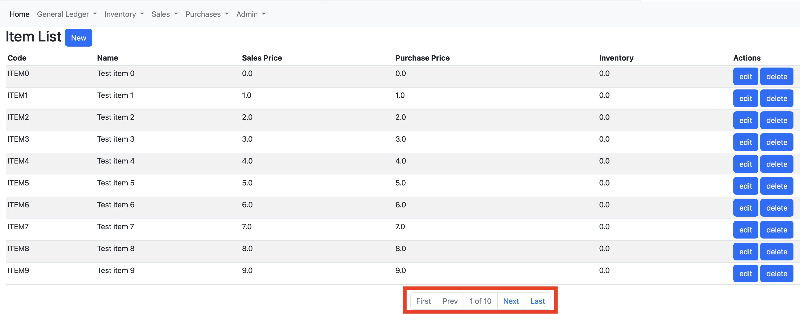

# erp

## TOC

- [Intro](#Intro)
- [Features](#Features)
- [Domain Model](#DomainModel)
- [UI](#UI)
- [Processes](#Processes)
- [Architecture](#Architecture)
- [Caveats](#Caveats)
- [Roadmap](#Roadmap)

## Intro

*erp* is a project which has two main goals:

* put in practice some distributed computing princinples;
* put in practice some Spring projects (Spring Boot, Spring Web, Sprint Data JPA, etc.);

To achieve these goals, *erp* is implemented as Java web application. It covers a very limited part of an [ERP](https://en.wikipedia.org/wiki/Enterprise_resource_planning) domain. See [Features](#Features) sections for more details regading implemented functionality.

## Features

The application provides the following set of features:

* inventory management:
  * manage a catalog of Items;
  * manage the inventory of Items;
  * manage movement (sales and purchases) of Items;
* sales management:
  * manage a catalog of Customers;
  * manage customer payments and refunds;
  * manage Sales Orders;
  * manage Sales Credit Memos;
  * manage Sales Order and Credit Memo posting;
  * manage Posted Sales Orders;
  * manage Posted Sales Credit Memos;
* purchases management
  * manage a catalog of Vendors
  * manage vendor payments and refunds;
  * manage Purchase Orders;
  * manage Purchase Credit Memos;
  * manage Purchase Order and Credit Memo posting;
  * manage Posted Purchase Orders;
  * manage Posted Purchase Credit Memos;
* financeial assets management
  * manage a catalog of Bank Accounts;
  * manage a catalog of Payment Methods;
  * managet bank accounts operations - payments, refunds, inter balance transfers;

## Domain Model

In order to provide the features describe above, the application is centered around a domain model and the objects it is comprised of.

Objects in the domain model can be classified in the following groups:

* nomenclature objects [N] - nomenclature objects form different catalogs in the system;
* operations objects [O] - operations objects represent various activities and actions performed by the users;
* setup objects [S] - setup objects represent different pieces of information which control the operations and processes of the system;

Here is a list of objects in the domain model, their classification (with [N], [O] or [S] after the object name) and short description:

**Item [N]** 

This object represents an entry in the Item catalog. Items could be traded in the system - sales and purchases. In this context, Item object has the following fields:

* code - unique identifier of the Item;
* name - description of the Item;
* sales price - the price which is used when selling the Item;
* purchase price - the price which is used when purchasing the Item;
* inventory - shows the current inventory of the Item. It is sum of all the quantities that have been purchases minus the quantities which have been sold.

**Customer [N]**

This object represents and entry in the Customer catalog. Customers are entities which Items are sold to. In order to do that, Sales documents are created and posted. In this context, Customer object has the following fields:

* code - unique identifier of the Customer;
* name - name of the Customer;
* address - address of the Customer;
* payment method - payment method of the Customer. Based on this payment method a payment is filed automatically or not. To be further described in the Payment Method object.
* balance - shows the current balance of the Customer. It is sum of all the amounts of Sales documents posted minus the payments done by the Customer. Positive balance means that the Customer ows the respective amount.

**Vendor [N]**

This object represents and entry in the Vendor catalog. Vendors are entities which Items are purchased from. In order to do that, Purchase documents are created and posted. In this context, Vendor object has the following fields:

* code - unique identifier of the Vendor;
* name - name of the Vendor;
* address - address of the Vendor;
* payment method - payment method of the Vendor. Based on this payment a payment is filed automatically or not. To be further described in the Payment Method object. 
* balance - shows the current balance of the Vendor. It is sum of all the amounts of Purchase documents posted minus the payments done by the Vendor. Positive balance means that the Vendor is woned the respective amount.

**Bank Account [N]**

This object represents an entity which stores financial assets. The name "Bank Account" implies that it is only accounts in a bank, but this is not the case. It could be any means of financial assets. Examples: a wallet, a vault, bank account in Bank X, bank account in Bank Y, etc. In this context, Bank Account object has the following fields:

* code - unique identifier of the Bank Account;
* name - name of the Bank Account;
* balance - shows the financial asserts available in the bank account. It is sum of all the payments and refunds done with the bank account. Besides payments and refunds, financial assets could be moved between bank accounts. These operations are entered in the system as free entries (instead of payment or refund). To be further described in the operations objects and Processes sections.

**Payment Methods [N]**

This object represents how payments from/to Customers/Vendors are done. There are two options:

* immediate payments - if the payment is immediate, a corresponding Bank Account is specified in the Payment Method. The payment/refund is done in this Bank Account.
* delayed payments - if the payment is delayed, no corresponding Bank Account is specified in the Payment Method. The payment/refund is done later and is entered into the system manually.

In this context, Payment Method object has the following fields:

* code - unique identifier of the Payment Method;
* name - name of the Payment Method;
* bank account - states of the payment method is immediate or delayed. See above;

**Sales Order [O]**

This object represents an **intent** by the Customer to **buy** a certain items. In this context, Sales Order object has the following fields:

* code - unique identifier of the Sales Order. Automatically generated by the system using code serie. See Code Serie object and Processes for mode details;
* customer - the Customer the order is done by;
* date - the date the order is created;
* payment method - by default this is taken from the Customer the order is done for. However, it could be changed for the concrete Sales Order;
* amount - shows the total amount of the Sales Order. It is sum of the amount of the respective Sales Order Lines. See below;

**Sales Order Line [O]**

This object represents a separate item uncluded in the Sales Order. In this context, Sales Order Line object has the following fields:

* sales order - shows the Sales Order this line belongs to;
* line no - since a single Sales Order could have multiple lines, this field is used to distinguish different lines belonging to a single Sales Order;
* item - the Item this line represents;
* quantity - the quantity of the Item that will be sold;
* price - the price the Item will be sold on. It is taken from the sales price field of the Item object. However, it could be changed for this particular Sales Order Line;
* amount - calculated by multiplying the quantity and the price fields;

**Sales Credit Memo [O]**

This object represents an **intent** by the Customer to **return** certain items. In this context, Sales Credit Memo object has the following fields:

* code - unique identifier of the Sales Order. Automatically generated by the system using code serie. See Code Serie object and Processes for mode details;
* customer - the Customer the credit memo is done by;
* date - the date the credit memo is created;
* payment method - by default this is taken from the Customer the order is done for. However, it could be changed for the concrete Sales Credit Memo;
* amount - shows the total amount of the Sales Credit Memo. It is sum of the amount of the respective Sales Credit Memo Lines. See below;

**Sales Credit Memo Line [O]**

This object represents a separate item uncluded in the Sales Credit Memo. In this context, Sales Credit Memo Line object has the following fields:

* sales credit memo - shows the Sales Credit Memo this line belongs to;
* line no - since a single Sales Credit Memo could have multiple lines, this field is used to distinguish different lines belonging to a single Sales Credit Memo;
* item - the Item this line represents;
* quantity - the quantity of the Item that will be returned;
* price - the price the Item will be returned on. It is taken from the sales price field of the Item object. However, it could be changed for this particular Sales Credit Mmeo Line;
* amount - calculated by multiplying the quantity and the price fields;

**Posted Sales Order [O]**

This object represents a **completed** (a.k.a. posted) operation by the Customer to **buy** a certain items. In this context, Posted Sales Order object has the following fields:

* code - unique identifier of the Sales Order. Automatically generated by the system using code serie. See Code Serie object and Processes for mode details;
* customer - the Customer the order is done by;
* date - the date the order is completed;
* payment method - taken from the Sales Order;
* order code - code of the Sales Order which was completed;
* order date - date of the Sales Order which was completed;
* amount - shows the total amount of the Sales Order. It is sum of the amount of the respective Sales Order Lines. See below;

**Posted Sales Order Line [O]**

This object represents a separate item uncluded in the Posted Sales Order. In this context, Posted Sales Order Line object has the following fields:

* posted sales order - shows the Posted Sales Order this line belongs to;
* line no - since a single Posted Sales Order could have multiple lines, this field is used to distinguish different lines belonging to a single Posted Sales Order;
* item - the Item this line represents;
* quantity - the quantity of the Item that was sold;
* price - the price the Item was sold on;
* amount - the amount the Item was sold on;

**Posted Sales Credit Memo [O]**

This object represents a **completed** (a.k.a. posted) operation by the Customer to **return** certain items. In this context, Posted Sales Credit Memo object has the following fields:

* code - unique identifier of the Sales Order. Automatically generated by the system using code serie. See Code Serie object and Processes for mode details;
* customer - the Customer the credit memo is done by;
* date - the date the credit memo is completed;
* payment method - taken from the Sales Credit Memo;
* order code - code of the Sales Credit Memo which was completed;
* order date - date of the Sales Credit Memo which was completed;
* amount - shows the total amount of the Posted Sales Credit Memo. It is sum of the amount of the respective Posted Sales Credit Memo Lines. See below;

**Posted Sales Credit Memo Line [O]**

This object represents a separate item uncluded in the Posted Sales Credit Memo. In this context, Posted Sales Credit Memo Line object has the following fields:

* posted sales credit memo - shows the Posted Sales Credit Memo this line belongs to;
* line no - since a single Posted Sales Credit Memo could have multiple lines, this field is used to distinguish different lines belonging to a single Posted Sales Credit Memo;
* item - the Item this line represents;
* quantity - the quantity of the Item that was returned;
* price - the price the Item was returned on;
* amount - the amount the Item was returned on;

**Purchase Order [O]**

This object represents an **intent** by the Vendor to **deliver** certain items. In this context, Purchase Order object has the following fields:

* code - unique identifier of the Sales Order. Automatically generated by the system using code serie. See Code Serie object and Processes for mode details;
* vendor - the Vendor the order is done by;
* date - the date the order is created;
* payment method - by default this is taken from the Vendor the order is done for. However, it could be changed for the concrete Purchase Order;
* amount - shows the total amount of the Purchase Order. It is sum of the amount of the respective Purchase Order Lines. See below;

**Purchase Order Line [O]**

This object represents a separate item uncluded in the Purchase Order. In this context, Purchase Order Line object has the following fields:

* purchase order - shows the Purchase Order this line belongs to;
* line no - since a single Purchase Order could have multiple lines, this field is used to distinguish different lines belonging to a single Purchase Order;
* item - the Item this line represents;
* quantity - the quantity of the Item that will be purchased;
* price - the price the Item will be purchased on. It is taken from the purchase price field of the Item object. However, it could be changed for this particular Purchase Order Line;
* amount - calculated by multiplying the quantity and the price fields;

**Purchase Credit Memo [O]**

This object represents an **intent** by the Vendor to **return** certain items. In this context, Purchase Credit Memo object has the following fields:

* code - unique identifier of the Sales Order. Automatically generated by the system using code serie. See Code Serie object and Processes for mode details;
* vendor - the Vendor the credit memo is done by;
* date - the date the credit memo is created;
* payment method - by default this is taken from the Vendor the order is done for. However, it could be changed for the concrete Purchase Credit Memo;
* amount - shows the total amount of the Purchase Credit Memo. It is sum of the amount of the respective Purchase Credit Memo Lines. See below;

**Purchase Credit Memo Line [O]**

This object represents a separate item uncluded in the Purchase Credit Memo. In this context, Purchase Credit Memo Line object has the following fields:

* purchase credit memo - shows the Purchase Credit Memo this line belongs to;
* line no - since a single Purchase Credit Memo could have multiple lines, this field is used to distinguish different lines belonging to a single Purchase Credit Memo;
* item - the Item this line represents;
* quantity - the quantity of the Item that will be returned;
* price - the price the Item will be returned on. It is taken from the purchase price field of the Item object. However, it could be changed for this particular Purchase Credit Mmeo Line;
* amount - calculated by multiplying the quantity and the price fields;

**Posted Purchase Order [O]**

This object represents a **completed** (a.k.a. posted) operation by the Vendor to **deliver** certain items. In this context, Posted Purchase Order object has the following fields:

* code - unique identifier of the Sales Order. Automatically generated by the system using code serie. See Code Serie object and Processes for mode details;
* vendor - the Purchase the order is done by;
* date - the date the order is completed;
* payment method - taken from the Purchase Order;
* order code - code of the Purchase Order which was completed;
* order date - date of the Purchase Order which was completed;
* amount - shows the total amount of the Posted Purchase Order. It is sum of the amount of the respective Posted Purchase Order Lines. See below;

**Posted Purchase Order Line [O]**

This object represents a separate item uncluded in the Posted Purchase Order. In this context, Posted Purchase Order Line object has the following fields:

* posted purchase order - shows the Posted Purchase Order this line belongs to;
* line no - since a single Posted Purchase Order could have multiple lines, this field is used to distinguish different lines belonging to a single Posted Purchase Order;
* item - the Item this line represents;
* quantity - the quantity of the Item that was delivered;
* price - the price the Item was delivered on;
* amount - the amount the Item was delivered on;

**Posted Purchase Credit Memo [O]**

This object represents a **completed** (a.k.a. posted) operation by the Vendor to **return** certain items. In this context, Posted Purchase Credit Memo object has the following fields:

* code - unique identifier of the Sales Order. Automatically generated by the system using code serie. See Code Serie object and Processes for mode details;
* vendor - the Vendor the credit memo is done by;
* date - the date the credit memo is completed;
* payment method - taken from the Purchase Credit Memo;
* order code - code of the Purchase Credit Memo which was completed;
* order date - date of the Purchase Credit Memo which was completed;
* amount - shows the total amount of the Posted Purchase Credit Memo. It is sum of the amount of the respective Posted Purchase Credit Memo Lines. See below;

**Posted Purchase Credit Memo Line [O]**

This object represents a separate item uncluded in the Posted Purchase Credit Memo. In this context, Posted Purchase Credit Memo Line object has the following fields:

* posted purchase credit memo - shows the Posted Purchase Credit Memo this line belongs to;
* line no - since a single Posted Purchase Credit Memo could have multiple lines, this field is used to distinguish different lines belonging to a single Posted Purchase Credit Memo;
* item - the Item this line represents;
* quantity - the quantity of the Item that was returned;
* price - the price the Item was returned on;
* amount - the amount the Item was returned on;

**Item Ledger Entry [O]**

This object abstracts completed operations related to Item. Currently the system only supports sales/purchase order/credit memos. So, sales/purchase order/credit memo lines could be used instead. However, having this object defined separetely makes it possible to extend the system with other kinds of Item-related operations - production (instead of purchasing), scraping (in case of expiration), etc. In this context, the Item Ledger Entry object has the following fields:

* id - unique identifier of the Item Ledger Entry. Currently, auto-increment strategy is used;
* item - the Item this Item Ledger Entry is related to;
* type - type of the entry. Currently possible values are SALES_ORDER, SALES_CREDIT_MEMO, PURCHASE_ORDER, PURCHASE_CREDIT_MEMO;
* quantity - the quantity the Item Ledger Entry represents. The value is positive if the operation increments the inventory of the Item. Example: purchase order, sales credit memo. The value is negative if the operation decrements the inventory of the Item. Example: sales order, purchase credit memo;
* date - the date the operation was completed on;
* document code - code of the document that caused the Item Ledger Entry to be created;

**Vendor Ledger Entry [O]**

This object abstracts completed operations related to Vendors. Normal operations include purchase orders and credit memos and the respective payments and refunds. However, there might be cases where some corrective actions need to be taken. In this cases the Vendor Ledger Entry objects gives the flexibility needed. In this context, Vendor Ledger Entry object has the following fields:

* id - unique identifier of the Vendor Ledger Entry. Currently, auto-increment strategy is used;
* vendor - the Vendor this Vendor Ledger Entry is related to;
* type - type of the entry. Currently possible values are PURCHASE_ORDER, PURCHASE_CREDIT_MEMO, PAYMENT, REFUND;
* amount - the amount the Vendor Ledger Entry represents. The value is positive if the operation increments the balance of the Vendor. Example: purchase order, refund. The value is negative if the operation decrements the balance of the Vendor. Example: purchase credit memo, payment.
* date - the date the operation was completed on;
* document code - code of the document that caused the Vendor Ledger Entry to be created;

**Customer Ledger Entry [O]**

This object abstracts completed operations related to Customers. Normal operations include sales orders and credit memos and the respective payments and refunds. However, there might be cases where some corrective actions need to be taken. In this cases the Customer Ledger Entry object gives the flexibility needed. In this context, Customer Ledger Entry object has the following fields:

* id - unique identifier of the Customer Ledger Entry. Currently, auto-increment strategy is used;
* customer - the Customer this Customer Ledger Entry is related to;
* type - type of the entry. Currently possible values are SALES_ORDER, SALES_CREDIT_MEMO, PAYMENT, REFUND;
* amount - the amount the Customer Ledger Entry represents. The value is positive if the operation increments the balance of the Customer. Example: sales order, refund. The value is negative if the operation decrements the balance of the Customer. Example: sales credit memo, payment.
* date - the date the operation was completed on;
* document code - code of the document that caused the Customer Ledger Entry to be created;

**Bank Account Ledger Entry [O]**

This object represents operations related to Bank Accounts. Normal operations include sales/purchase order/credit memo payments/refunds. There may be cases where amounts need to be added/removed to/from bank account outside of the context of a particular document. Example: transfering funds between bank accounts. In this case the Bank Account Ledger Entry object gives the flxibility needed. In this context, Bank Account Ledger Entry object has the following fields:

* id - unique identifier of the Bank Account Ledger Entry. Currently, auto-increment strategy is used;
* bank account - the Bank Account this Bank Account Ledger Entry is related to;
* type - type of the entry. Currently possible values are FREE_ENTRY, CUSTOMER_PAYMENT, CUSTOMER_REFUND, VENDOR_PAYMENT, VENDOR_REFUND;
* amount - the amount the Bank Account Ledger Entry represents. The value is positive if the operation increments the balance of the Bank Account. Example: customer payment, vendor refund. The value is begative if the operation decrements the balance of the Bank Account. Example: customer refund, vendor payment.
* date - the date the operation was completed on;
* document code - code of the document that caused the Bank Account Ledger Entry to be created;

**General Journal Batch [O]**

As it was already mentioned, normal operations of the system include creating and posting sales and purchase orders and credit memos. However, there are cases when some corrective actions need to be taken. These actions can not be covered by purchase and sales documents. To cover these cases, there is a general journal functionality. General Journal Batch object is a way to group those corrective actions mentioned above. In this context, the General Journal Batch object has the following fields:

* code - unique identifier of the General Journal Batch;
* name - name of the General Journal batch;

**General Journal Batch Line [O]**

This object represents an **intent** for a correction action described above. In this context, the object has the following fields:

* general journal batch code - unique identifier of the General Journal Batch that this General Journal Batch Line belongs to;
* line no - since a General Journal Batch can have multiple related General Journal Batch Lines, this field is used to distinguish different General Journal Batch Lines;
* source type - possible values are CUSTOMER, VENDOR, BANK_ACCOUNT. This field shows which object this corrective action is aimed to;
* source code - unique identifier of the object the corrective action belongs to. If Source Type is CUSTOMER, then this field contains Customer code and so on;
* source name - name of the object the corrective action belongs to. If Source Type is Customer, then this field contains Customer name and so on;
* operation type - possible values are EMPTY, ORDER, CREDIT_MEMO, PAYMENT, REFUND. If Source Type is Customer or Vendor, then values that make sense are ORDER, CREDIT_MEMO, PAYMENT and REFUND. This way the corrective action will cause the respective Customer/Vendor Ledger Entries to be created. If Source Type is Bank Account, then the meaningful option to select is EMPTY. Example usage: to enter the initial balance of Bank Accounts;
* document code - if the corrective action is representing a document or payment/refund, then this field could be used to state the respective Document code;
* date - date of the corrective action;
* amount - the amount that will be corrected;
* target - this field is used when Operation Type is PAYMENT or REFUND. In this case, the amount that will be payed/refunded will be taken from/returned to the Bank Account selected in this field;

**Code Serie [S]**

This object represents series of codes. These codes are used as codes in various documents that are managed in the system - sales/purchase orders/credit memos/posted orders/posted credit memos. In this context, this object has the following fields:

* code - unique identifier of the Code Serie;
* name - description of the Code Serie;
* first code - the first code in the serie. The value should begin with an alpha symbol and then follow several digits. The digits form a number, which is increased every time a code is generated from the serie. Example: SO000 is the first code. Next ones are SO001, SO002, SO003 and so on;
* last code - the last code in the serie. When a new code is generated from the serie, it is updated in this field. If empty, the value from the first code field is used;

**Setup [S]**

This object holds various configuration options of the system. This object is intended to have only a single instance. It is automatically created by the system and values are populated by the administrator of the system. In this context, this object has the following fields:

* code - unique identifier of the object. As it was stated above, the object has only one instance which is automatically created by the system. The value the systems sets is empty string;
* sales order code serie - code serie used to generate codes for new Sales Orders;
* purchase order code serie - code serie used to generate codes for new Purchase Orders;
* sales credit memo code serie - code serie used to generate codes for new Sales Credit Memos;
* purchase credit memo code serie - code serie used to generate codes for new Purchase Credit Memos;
* posted sales order code serie - code serie used to generate codes for Posted Sales Orders;
* posted purchase order code serie - code serie used to generate codes for Posted Purchase Orders;
* posted sales credit memo code serie - code serie used to generate codes for Posted Sales Credit Memos;
* posted purchase credit memo code serie - code serie used to generate codes for Posted Purchase Credit Memos;

## UI

The system has several basic UI elements:

* navigation

This is the entrypoint to the system. The navigation tab is displayed on every page of the system. It shows the main functional areas of the system:

Clicking on each of the main elements in the navigation tab shows the elements of that functional area.

General Ledger:

Inventory:

Sales:

Purchases:

Admin:

* list 

Clicking on each of the elements in the navigation opens the list of the respective object. Example: Items

Each list has several building blocks:

Header:

"New" button - this is available only for objects which can be created manualy by the user

Table Header - shows the names of the columns (fields) of the object that is listed:

Table Lines - shows the actual data, the values of the respective fields of the object being listed:

Actions - this is usually the last column of the list. It contains buttons to perform various actions over the respective instance of the object being listed:

Paging - at the bottim of each list there is a section which contains elements to navigate through the pages of the object being listed:

* card

Card elements are used to create new and/or update existing instances of a particular object. Example: Item

As stated above, card element could be used to create new objects or update existing ones. When used for updating existing ones, it is already populated with the data of the object being edited:

When a card is used for existing object instance, a sublist could also be displayed in the card. This sublist contains information regarding objects related to the main object displayed in the card. Example: in the Item card you see a list of Item Ledger Entries as a sublist:

* wizard

There are some objects which can not be created with a single step. This means that values in some fields are populated automatically based on the values selected in other fields - Sales/Purchase Document Line price is populated from the Item selected in the item field. There are other cases, where values that could be populated in a certain field depend on the value selected in other fields - Source Code field in General Journal Batch Line is populated depending on the value selected in the field Source Type. To cover these cases there is a UI element called Wizard. Wizards are composed of different pages. On each page you select a value and then move on to the next one depending on the values selected on the previous page. Example: Sales Order Wizard:

It is triggered by clicking "New" button on the Sales Order List:

Triggering the Sales Order wizard opens its first page. Sales Order customer is selected on the first page of the Sales Order wizard:

Once you select the customer for the sales order, clicking "Next" moves to the second page of the Sales Order wizard:

You can see on the second page you can select the Payment Method for the Sales Order. The value of the Payment Method is populated from the payment method field of the Customer selected on the previous page. This is an example where values in some fields are populated based on values selected in other fields. 

Clicking finish on the last page of the Sales Order Wizard creates a new Sales Order and redirects to the Sales Order Card.

Other objects which are created/updated using wizards are:

- Sales Order
- Sales Order Line
- Purchase Order
- Purchase Order Line
- Sales Credit Memo
- Sales Credit Memo Line
- Purchase Credit Memo
- Purchase Credit Memo Line
- General Journal Batch Line 

## Processes

Besides creating, updating, listing and deleting the domain model objects, there is one main action that could be executed in the system - posting. As it was mentioned in the Domain Model section, Sales/Purchase Orders represent the **intent** of a Customer/Vendor to buy/deliver Items. **Posting** a sales/purchase document (order or credit memo) is confirming this intent and materializes it. This is the simplest way to describe the **Posting** process.

When you post a Sales Order, the following actions are performed by the system:

- Posted Sales Order is created using the information from the Sales Order;
- for each Sales Order Line a corresponding Posted Sales Order Line is created;
- for each Sales Order Line a corresponding Item Ledger Entry is created;
- Customer Ledger Entry is created;
- depending on the Payment Method, payment/refund Customer Ledger is created;
- depending on the Payment Method, Bank Account Ledger entry is created;
- Sales Order Lines are deleted;
- Sales Order is deleted;

All the actions described above are performed in a transaction.

Respective actions are performed when you post Sales Credit Memo, Purchase Order, Purchase Credit Memo and General Journal Batch.

There are some checks which are performed during Posting of documents which could also cause the whole operation (transaction) to fail and be aborted (rollbacked):

- Sales Order - Item inventory is checked. If there is not enough inventory of a given Item to sell to the Customer, Post operation fails;
- Sales Credit Memo - if the Payment Method selected will cause a Customer Refund to be made, Bank Account balance is checked. If there is not enough balance of a given Bank Account to refund the Customer, Post operation fails;
- Purchase Order - if the Payment Method selected will cause a Vendor Payment to be made, Bank Account balance is checked. If there is not enough balance of a given Bank Account to pay the Vendor, Post operation fails;
- Purchase Credit Memo - Item inventory is checked. If there is not enough inventory of a given Item to return to the Vendor, Post operation fails;

## Architecture

**erp** is simple monolith application. It handles all the user requests as well as processing the business process of posting various documents and general journal batches. The application has a single dependency which it communcates with. This is the database system where the application stores its data.

## Caveats

It was described in the Intro section what the main goals of the project are. In order to focus on the main goals, some other features and functionalities were intentionally left out. Here are some of them:

* no sorting/filtering in any of the list UIs;
* no data validation when creating any of the objects;
* no user context;
* no authentication/authorization;

## Roadmap

The application will be developed through the following stages:

* separate UI and backend;
* refactor posting to be asynchronous;
* separate backend into domain-based microservices - inventory, sales, purchases, etc.
